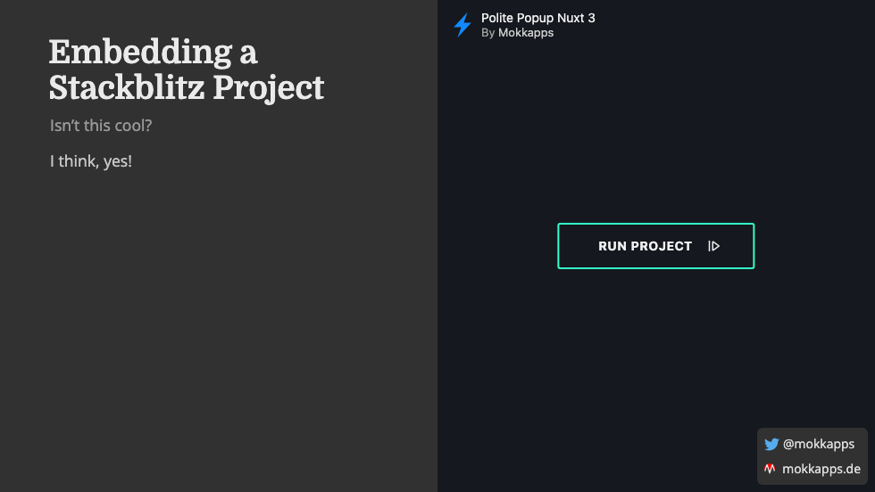

# slidev-theme-mokkapps

A theme for [Slidev](https://github.com/slidevjs/slidev).

<!--
  Learn more about how to write a theme:
  https://sli.dev/themes/write-a-theme.html
--->

<!--
  run `npm run dev` to check out the slides for more details of how to start writing a theme
-->

<!--
  Put some screenshots here to demonstrate your theme

  Live demo: [...]
-->

## Install

Add the following frontmatter to your `slides.md`. Start Slidev then it will prompt you to install the theme automatically.

<pre><code>---
theme: <b>mokkapps</b>
---</code></pre>

Learn more about [how to use a theme](https://sli.dev/themes/use).

## Layouts

This theme provides the following layouts:

## Components

This theme provides the following components:

> TODO:

## Contributing

- `npm install`
- `npm run dev` to start theme preview of `example.md`
- Edit the `example.md` and style to see the changes
- `npm run export` to generate the preview PDF
- `npm run screenshot` to generate the preview PNG
